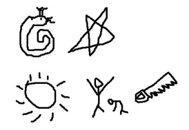

# 빅뱅의 여섯 번째 멤버

| 시간 제한 | 메모리 제한 | 제출 | 정답 | 맞은 사람 | 정답 비율 |
| :-------- | :---------- | :--- | :--- | :-------- | :-------- |
| 2 초      | 128 MB      | 351  | 114  | 86        | 43.000%   |

## 문제

빅뱅은 다섯 명이다. 이종혁 조교는 빅뱅을 다음과 같이 그렸다.



이 그림을 본 YG의 양현석 사장은 이종혁을 빅뱅의 여섯 번째 멤버로 영입하려고 한다.

양현석 사장은 오디션 대신 이종혁에게 다음과 같은 문제를 풀라고 명령했다.


육각형 0개, 1개, 2개, 3개를 위와 같이 점 하나를 중심으로 겹쳐서 그려보자. 그럼 1, 6, 15, 28, 45, 66과 같은 수열이 하나 나온다. 이를 빅뱅수라고 한다.

일단 이종혁은 1791보다 큰 수는 항상 빅뱅수 4개의 합으로 만들 수 있다는 것을 증명했다. 그리고 잠시 더 생각해보니 수가 충분히 크다면 항상 빅뱅수 3개의 합으로 만들 수 있다는 것도 증명했다.

하지만 양현석 사장은 위의 두 가지 증명에도 불구하고 이종혁을 빅뱅의 여섯 번째 멤버로 뽑지 않고, 다음과 같은 문제를 하나 더 내주었다.

어떤 수 N이 있을 때, 이 수를 나타내기 위해 필요한 빅뱅수 개수의 최솟값은 몇 개인가? (빅뱅수의 합으로 N를 만드는 것이다.)

| N    | 최소 개수 | 합          |
| :--- | :-------- | :---------- |
| 1    | 1         | 1           |
| 2    | 2         | 1+1         |
| 3    | 3         | 1+1+1       |
| 4    | 4         | 1+1+1+1     |
| 5    | 5         | 1+1+1+1+1   |
| 6    | 1         | 6           |
| 7    | 2         | 1+6         |
| 8    | 3         | 1+1+6       |
| 9    | 4         | 1+1+1+6     |
| 10   | 5         | 1+1+1+1+6   |
| 11   | 6         | 1+1+1+1+1+6 |
| 12   | 2         | 6+6         |

이종혁은 1791보다 큰 수에 대해 답이 항상 4보다 작거나 같은 것을 알고 있고, 답이 아무리 커도 6을 넘을 수 없다는 것을 알고 있다. 또 답이 6인 것은 11과 26밖에 없다는 것을 알고 있다.

- 답이 6인 가장 큰 N은 26이고,
- 답이 5인 가장 큰 N은 130이고,
- 답이 4인 가장 큰 N은 146858이다.

## 입력

첫째 줄에 N이 주어진다. N은 1000000보다 작거나 같은 자연수이다.

## 출력

첫째 줄에 N을 만들기 위해 필요한 빅뱅수 개수의 최솟값을 출력한다.

## 예제 입력 1 복사

```
26
```

## 예제 출력 1 복사

```
6
```

